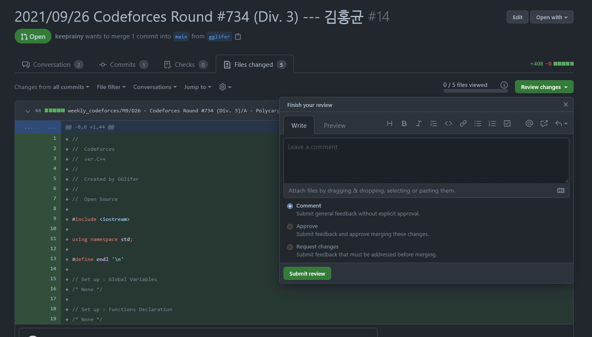

# cofocofo

## Member 

<table align="center">
    <tr>
        <td align="center">
            
        </td>
        <td align="center">
            
        </td>
        <td align="center">
            
        </td>
    </tr>
    <tr>
        <td align="center">구미 6반</td>
        <td align="center">구미 6반</td>
        <td align="center">구미 6반</td>
    </tr>
    <tr>
        <td align="center">우지현</td>
        <td align="center">김민수</td>
        <td align="center">이유진</td>
    </tr>
</table>

<table align="center">
    <tr>
        <td align="center">
            
        </td>
        <td align="center">
            
        </td>
        <td align="center">
            
        </td>
    </tr>
    <tr>
        <td align="center">서울 1반</td>
        <td align="center">서울 10반</td>
        <td align="center">서울 10반</td>
    </tr>
    <tr>
        <td align="center">한승주</td>
        <td align="center">이민동</td>
        <td align="center">김홍균</td>
    </tr>
</table>

<table align="center">
    <tr>
        <td align="center">
            
        </td>
        <td align="center">
            
        </td>
        <td align="center">
            
        </td>
    </tr>
    <tr>
        <td align="center">부울경 3반</td>
        <td align="center">광주 3반</td>
        <td align="center">구미 6반</td>
    </tr>
    <tr>
        <td align="center">김서진</td>
        <td align="center">김승환</td>
        <td align="center">김주환</td>
    </tr>
</table>

## Log

    
2021/09

* ### 2021/09
    * #### D19(일)

      #### 

        * Codeforces Round #739 (Div. 3)
        * [Tutorials & Solutions](https://codeforces.com/blog/entry/94009)
        * [Scores](https://github.com/cofocofo/cofocofo/issues/19#issuecomment-932934405)

    * #### D26(일)

      #### 

        * Codeforces Round #734 (Div. 3)
        * [Tutorials & Solutions](https://codeforces.com/blog/entry/93149)
        * [Scores](https://github.com/cofocofo/cofocofo/issues/19#issuecomment-932934549)

    * #### D28(화)

      #### 

        * Codeforces round #744 (Div. 3)
        * [Tutorials & Solutions](https://codeforces.com/blog/entry/95447)
        * [Scores](https://github.com/cofocofo/cofocofo/issues/19#issuecomment-932934609)

* ### 2021/10
  * #### D2(토)
    
    #### 
    
    * Codeforces Round #731 (Div. 3)
    * [Tutorials & Solutions](https://codeforces.com/blog/entry/92715)
    * [Scores](https://github.com/cofocofo/cofocofo/issues/19#issuecomment-932937052)
    
  * #### D10(일)

    #### 

    * Codeforces Round #725 (Div. 3)
    * [Tutorials & Solutions](https://codeforces.com/blog/entry/91637)
    * [Scores](https://github.com/cofocofo/cofocofo/issues/19#issuecomment-939500812)

  * #### D16(토)

    #### 
    
    * Codeforces Round #719 (Div. 3)
    * [Tutorials & Solutions](https://codeforces.com/blog/entry/90342)
    * [Scores](https://github.com/cofocofo/cofocofo/issues/19#issuecomment-944901759)
  
  * #### D24(일)

    #### 
  
    * Codeforces Round #713 (Div. 3)
    * [Tutorials & Solutions](https://codeforces.com/blog/entry/89535)
    * [Scores](https://github.com/cofocofo/cofocofo/issues/19#issuecomment-950316084)

  * #### D30(토)

    #### 

    * Codeforces Round #710 (Div. 3)
    * [Tutorials & Solutions](https://codeforces.com/blog/entry/89007)
    * [Scores](https://github.com/cofocofo/cofocofo/issues/19#issuecomment-955321623)

## Code Submit

0. Git CLI 를 사용합니다.
1. git clone https://github.com/cofocofo/cofocofo.git
   * 먼저, cofocofo Repo 를 clone 해주세요!
2. git checkout -b <branch_name>
   * 원하시는 이름으로 main branch 에서 원하시는 이름으로새 branch 를 만들어주세요!
   * 영어로 해주시기를 바랍니다 (한글로 하면 아마 에러가 뜰겁니다 ㅠ)
   * 이미, 만드신 branch 가 있다면 '-b' 옵션은 빼주세요!
   * **꼭 현재 branch 가 자신의 branch 인지 확인해주세요**
3. git merge main & git push
   * 본인 branch 를 main branch 에 맞추어 최신 상태로 갱신해줍니다 ;)
4. weekly_codeforces 디렉토리에서 해당 Codeforces Round 를 찾아주세요!
   * ex) weekly_codeforces/M9/D9 - Codeforces Round #739 (Div. 3)
5. 파일이름은 <대회 내 문제번호(A, B, C, ...)>_<한글이름> 으로 해주세요.
   * ex) A_김홍균.cpp
   * ex) B1_김홍균.java
   * ex) C_김홍균.py
6. git add .
   * 파일 작성을 모두 마치셨다면 위 cmd 를 통해 staging 해주세요!
7. git commit -m "<커밋메시지>"
    * staging 하신 후 commit 해주세요
    * 메세지 형식은 자유롭게 해주세요 ;)
    * 아니면, 아래 PR 의 형식을 따르셔도 좋습니다 ㅎㅎ
8. git push
    * 처음에는 git push --set-up-stream origin <branch_name> 이라고 나올텐데
    * 위 cmd 그대로 입력해주세요
    * 저는 branch 이름이 'gglifer' 이므로 <branch_name> 에 gglifer 를 입력했습니다!
9. https://github.com/cofocofo/cofocofo 링크로 cofocofo Repo 로 이동합니다
10. 화면 정중앙의 Compare & Pull Request 버튼을 눌러주세요
    * 저희 본인의 branch 에서 새롭게 push 하면 위와 같은 버튼이 생깁니다!
11. Pull Request(PR) 메시지는 \<YYYY\>/\<MM\>/\<DD\> <코드포스 라운드 이름> ---  <한글이름> 으로 입력해주세요!
    * ex) 2021/09/26 Codeforces Round #734 (Div. 3) --- 김홍균
12. Pull Request 가 올라가는 것을 확인하면 성공!
    * GitHub Repo 에서 Pull requests 탭을 누르면 본인의 PR 확인 가능합니다!

### Feedback

1. Repo 상단의 Pull requests 에서 다른 분들의 Pull Request 를 확인하실 수 있습니다
2. 피드백을 시작해주세요.
   * 직설적이고 깐깐할수록 서로간의 실력이 향상됩니다
   * 정중하되 뼈를 때리는 조언으로 서로의 실력을 높여주세요!
3. 각 PR 마다 3분 이상에게 승인 받지 못하면 merge 가 불가능하니 다들 꼭꼭 피드백해주세요!!!
   * PR 의 Conversation 탭을 누르면 현재까지 받은 피드백을 모두 볼 수 있습니다
   * PR 의 Files changed 를 누르면 코드 한줄한줄에 피드백을 달 수 있습니다
   * 충분히 피드백이 이루어졌다고 생각하시면 Files changed 탭에서 Review changes 를 눌러주세요
   * Finish your review 가 보이면서 Approve 를 통해 승인할 수 있습니다
   * 바로 이 승인을 받아야 merge 가 가능해집니다!!!
   
4. 모든 분들은 다른 사람들께 받은 피드백을 통해 활발히 코드를 수정해주세요
   * 문제를 푸는 것보다 받은 피드백을 바탕으로 코드를 수정하는 것이
   * 본인의 실력 향상에 매우 좋습니다!!!

### Git Tutorial

개발자라면 응당 적정수준의 Git 실력이 필요합니다.  
Git 이 익숙치 않다면 아래의 Git Tutorial 로 같이 시작해봐요! 
* https://git-scm.com/book/ko/v2
